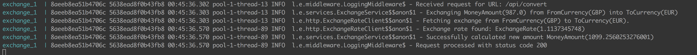
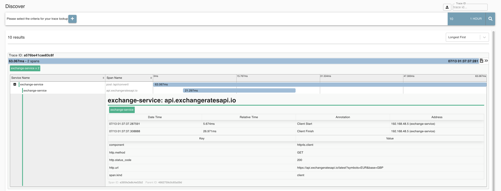
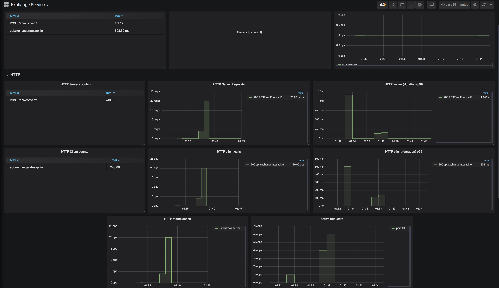

#### Getting Started
- Install [docker](https://docs.docker.com/install/) and [docker-compose](https://docs.docker.com/compose/install/)
- Run `docker-compose build` (unfortunately this may take 
a while as the dependencies have to be fetched (shouldn't take more than 3 or 4m)
- Run `docker-compose up -d` 
- Check if the  service is up by running `curl -v http://127.0.0.1:9000/_meta/health` ; 
- You can now access the service on : `localhost:9000` !!!
- Try `curl -X POST "localhost:9000/api/convert" --data '{"fromCurrency": "GBP", "toCurrency": "EUR", "amount": 987}'`
- Executing `requests.sh` will initially fire up to 50 request in parallel and then fire one request at a time (this makes the metrics a little bit more interesting)

#### Logging
Correlation id's are being printed with the log calls which can be used to group logs generated
within the same call/transaction (these id's are the same as the ones exported to Zipkin).
In order to check the logs printed by the service you can run:
`docker-compose logs -f exchange`

#### Zipkin 
Zipkin can be viewed on port 9411.

#### Grafana
Grafana is running on port 3000. Credentials are admin/admin.
 
 
Note: In order to make grafana dashboards available without them having to be imported, a volume `docker/data/grafana` is mounted in the 
container.

#### Tools & Libraries used
- cats
- cats-effect 
- http4s (HTTP server & client)
- circe (JSON encoding/decoding)
- Kamon (Tracing & Metric collection)
- Docker/Docker-compose (orchestration)
- Grafana (Metrics dashboards)
- InfluxDB (Time series storage)
- Zipkin (Trace visualization & Storage)

#### 
This project was loosely inspired by [this](https://github.com/cmcmteixeira/foobar-tracing-demo). [This](https://github.com/porchgeese/service.g8) template was used to create the service (though some alterations had to be made because the template is not 100% correct). 
Note:  (both the porchgeese org and the foobar demo were developed and are owned by me).
